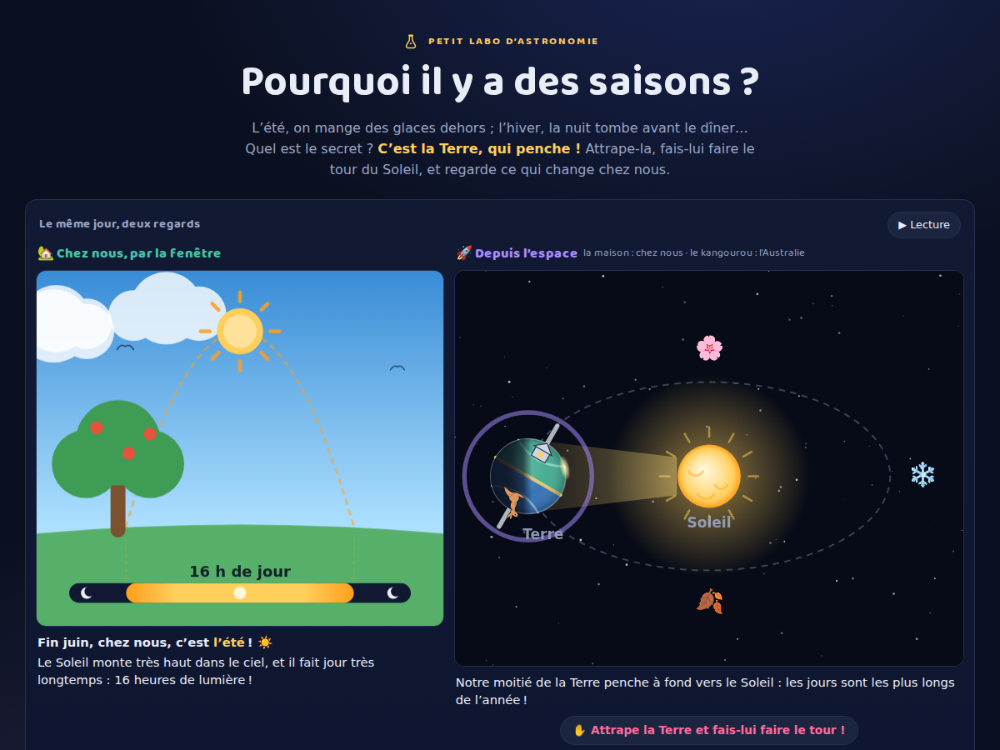
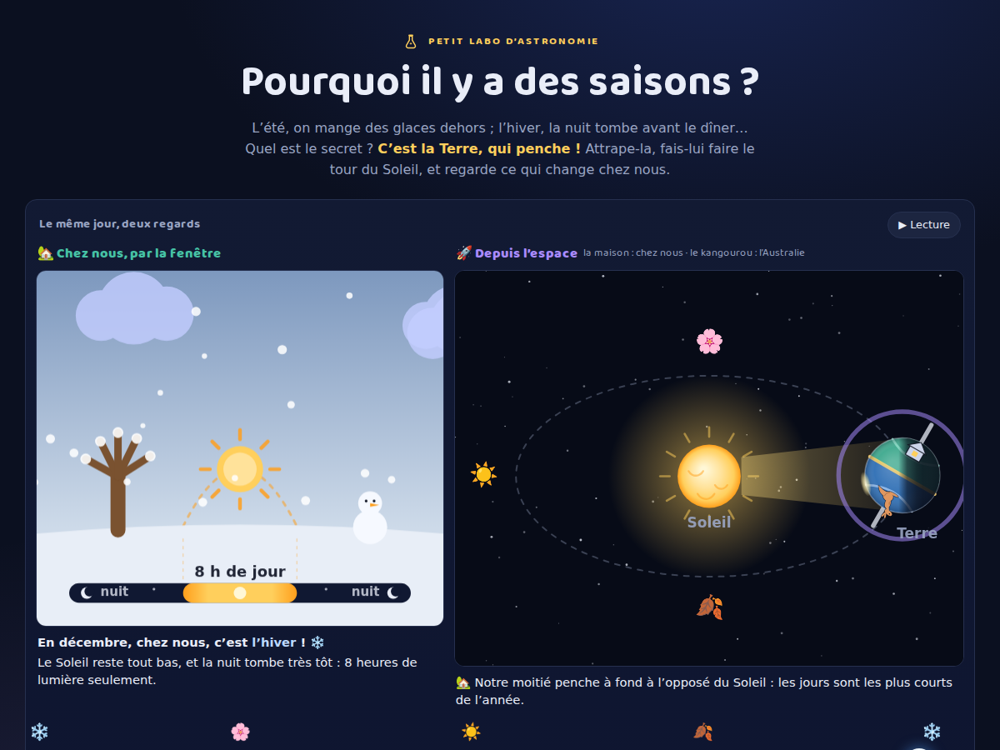

# Pourquoi il y a des saisons ?

**Petit labo d'astronomie** — un site d'une page, en français, qui explique les
saisons à un enfant d'environ 5 ans. Le parent lit à voix haute ; l'enfant
attrape la Terre penchée et lui fait faire le tour du Soleil.

L'idée centrale, celle que l'enfant doit retenir :

> La Terre est penchée, et elle garde son penchant toute l'année. En faisant le
> tour du Soleil, c'est tantôt notre moitié qui penche vers lui (l'été), tantôt
> l'autre (l'hiver).

| Été | Hiver |
|---|---|
|  |  |

## Fonctionnalités

- **Le geste-signature** : attraper la Terre et la faire glisser le long de son
  orbite — l'année défile sous le doigt, le Soleil reste fixe au centre et l'axe
  garde son penchant, quoi qu'il arrive. La Terre montre ses deux moitiés
  (maison au nord, kangourou au sud, équateur doré) — sans jour/nuit : à
  l'échelle de l'année, seul le penchant compte.
- **La fenêtre de chez nous**, toujours synchronisée : le Soleil de midi qui
  monte haut l'été et reste bas l'hiver, l'arbre du jardin (nu, fleuri, vert,
  roux), la barre du jour (8 h à 16 h de lumière) et la petite phrase du moment.
- **Le grand curseur de l'année** : de janvier à décembre, avec la piste qui
  raconte elle-même les saisons.
- **Le conteur** : l'explication s'écoute (synthèse vocale du navigateur, voix
  française choisie automatiquement, menu 🗣 pour en changer). Sans synthèse,
  les boutons se cachent et le site reste complet.
- **Le médaillon flottant (mobile)** : quand la fenêtre sort de l'écran, une
  miniature suit l'enfant en haut à droite — un tap y ramène.
- **La note aux parents** : chaque simplification assumée, expliquée avec les
  vrais chiffres.

## Lancer en local

```bash
python3 -m http.server 8123
# puis ouvrir http://localhost:8123/
```

Aucune dépendance, aucun build : HTML + CSS + JS vanilla (modules ES), canvas 2D
dessiné à la main. Le site se déploie tel quel sur GitHub Pages (workflow
`.github/workflows/deploy-pages.yml`, publication à chaque push sur `main` —
réglage : Settings → Pages → GitHub Actions).

## Tests

```bash
node test/model.test.mjs
```

Le modèle est pur (aucun accès DOM) et les « vérités à préserver » sont des
tests nommés en français : l'axe garde toujours la même direction ; été en
France = hiver en Australie ; la distance au Soleil n'explique rien ; en été le
Soleil monte plus haut et les jours durent plus longtemps ; aux équinoxes, jour
et nuit durent 12 h. Une suite navigateur (Playwright, maintenue hors dépôt)
vérifie la structure, le geste-signature, les invariants visuels (sondes de
pixels : le Soleil doré fixe au centre) et l'absence d'erreurs console, en
desktop, `prefers-reduced-motion` et mobile 390 px.

## Ce que le site simplifie

- **Le penchant est exagéré au dessin** : 30° à l'écran, 23,44° en vrai. Sa
  direction reste quasi fixe d'une année sur l'autre (précession sur ~26 000
  ans, ignorée).
- **La distance ne fait pas les saisons** — et le site la garde constante.
  En vrai l'orbite est quasi circulaire et la Terre est même un peu *plus près*
  du Soleil début janvier (147 millions de km) qu'en juillet (152 millions).
- **Solstices et équinoxes sont espacés régulièrement** (tous les quarts
  d'année). Vraies dates : équinoxes vers les 20 mars et 22-23 septembre,
  solstices vers les 20-21 juin et 21-22 décembre ; les saisons n'ont pas
  exactement la même durée (orbite légèrement elliptique). L'année du site fait
  365 jours tout ronds.
- **Les chiffres de la fenêtre sont ceux de la France** (latitude ~47° nord),
  avec une formule sinusoïdale simple : Soleil de midi entre ~20° et ~66°,
  jour entre 8 h et 16 h. À l'équateur, presque pas de variation ; aux pôles,
  soleil de minuit et nuit polaire.
- **Pas de températures affichées.** Le site montre les causes (hauteur du
  Soleil, durée du jour) et relie la chaleur en une phrase ; la météo réelle
  suit avec du retard (inertie thermique : le plus chaud fin juillet-août, le
  plus froid fin janvier) et ses caprices — expliqué dans la note aux parents.
- **Une seule maison, l'hémisphère nord.** L'Australie de l'histoire vit les
  saisons à l'envers ; près de l'équateur on parle plutôt de saison sèche et de
  saison des pluies.
- **La rotation quotidienne est ignorée** dans la vue de l'espace : ni rotation,
  ni côté nuit dessinés — le jour et la nuit ont leur propre épisode
  (ci-dessous). La maison (~45° nord) et le kangourou (~45° sud) marquent les
  hémisphères sans prétendre à la vraie géographie.

## Structure

```
index.html           la page unique
css/style.css        palette commune de la série astronomie (fond nuit)
js/model.js          modèle pur + constantes du récit (saisons, mois, phrases)
js/vue-orbite.js     la vue de l'espace (Soleil fixe, orbite, geste-signature)
js/vue-fenetre.js    chez nous par la fenêtre (+ dessinerMiniFenetre, médaillon)
js/main.js           câblage : boucle rAF, curseur, geste, conteur, médaillon
test/model.test.mjs  tests du modèle (Node)
docs/                captures d'écran du README
```

## La série

Petit labo d'astronomie 🌌 :

- [La mécanique des éclipses](https://davidb-prog.github.io/eclipse-explorer/)
- [Où va le Soleil la nuit ?](https://davidb-prog.github.io/ou-va-le-soleil/)
- [Quelle heure est-il là-bas ?](https://davidb-prog.github.io/la-terre-tourne/)
- [Pourquoi la Lune change de forme ?](https://davidb-prog.github.io/la-lune-change-de-forme/)
- **Pourquoi il y a des saisons ?** (cet épisode)
